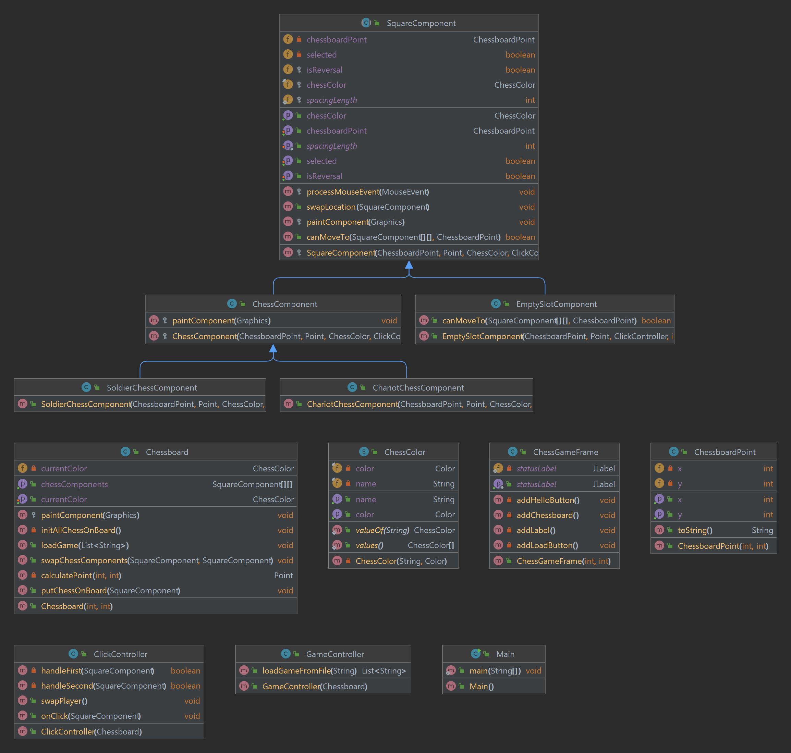

# DarkChess

This is the project for SUSTech_CS107A.

------

## Important

### commit规范

- commit信息应遵循Angular规范，建议使用Intellij IDEA的插件Git Commit Temperate
- 每个commit的更改内容应该尽可能保持小范围且集中
- 尽可能确保commit时源码能够正常编译，正常运行，通过测试

------

## Develop Log

### 11-14 提供demo

1. 尝试阅读demo代码

2. 学习uml图，尝试对demo进行uml图构建，帮助理解项目架构

   
   
   

